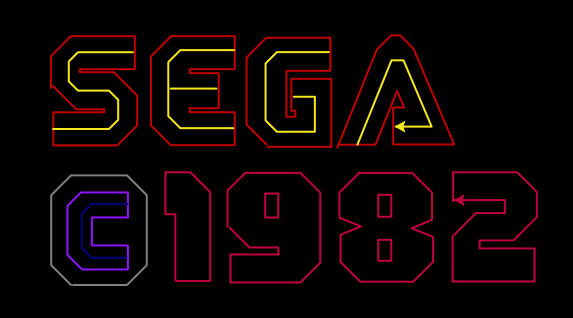
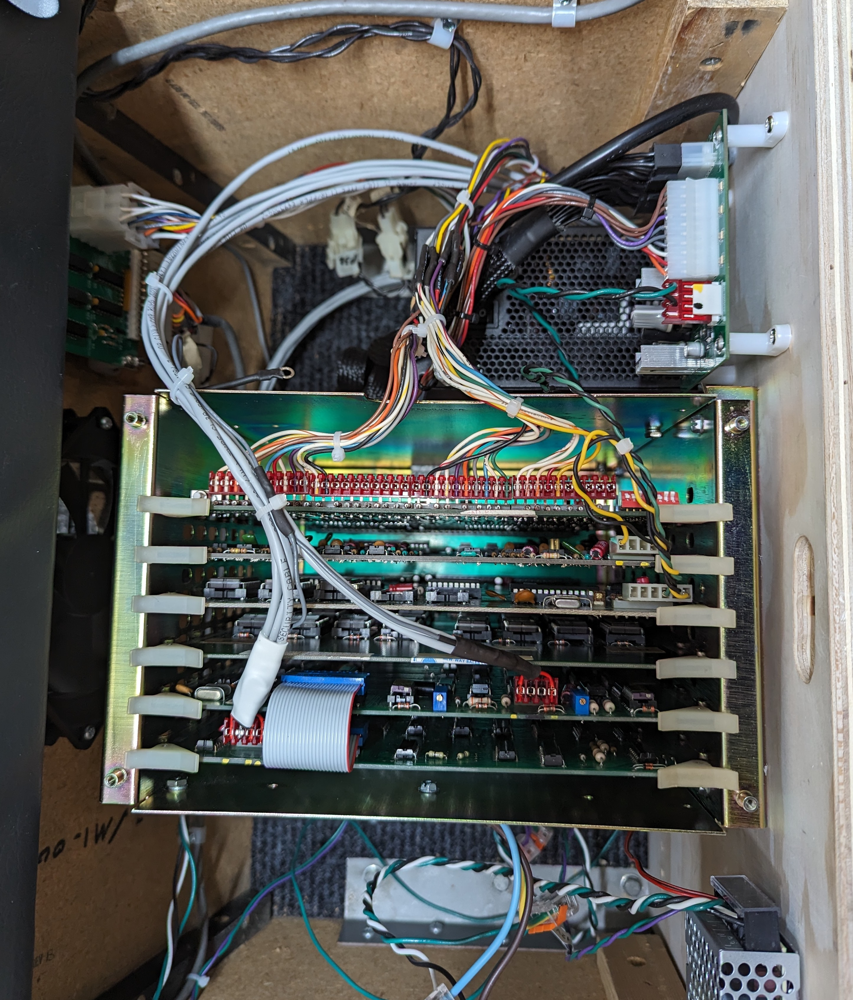

# sega-g80-vector-homebrew


## Follow along as we develop a new game for a SEGA G80 vector display arcade from 1982.

* Runs as it would have in 1982 on the original Sega G80 boardsets
* Does not use emulation or Rasberry Pi or MAME
* Programmed in C rather than period correct Z80 assembly
* Runs on a Zilog Z80 at 3.86712 MHz, only <32KB ROM and 2KB RAM
* Integrates with the Sega XY vector coprocessor (a two board set of 74k logic)
* Programs and uses the 8035 CPUs on the sound and speech boards
* Burn directly to 2716 ROMs and run in the real game
* Can also run without hardware by pretending to be StarTrek, just copy over the factory ROMs

# Building the ROM yourself
```
export PATH=${PATH}:/Users/jmathews/Desktop/z88dk/bin
export ZCCCFG=/Users/jmathews/Desktop/z88dk/lib/config
make
```
## Dependencies
* https://github.com/z88dk/z88dk/releases
* export PATH=${PATH}:/Users/jmathews/Desktop/z88dk/bin
* export ZCCCFG=/Users/jmathews/Desktop/z88dk/lib/config
* ROM Emulator https://github.com/Kris-Sekula/EPROM-EMU-NG/

[](https://youtube.com/playlist?list=PL5WwuS3ViybqfLWkKmgaT5_N2kVawZYZk)

# Bonus tooling
Dump the vectors from the factory ROMs

Or create complex vectors in your favorite SVG editor and convert to Sega vector format
```
python3 ./sega2svg.py
python3 ./svg2sega.py
```




